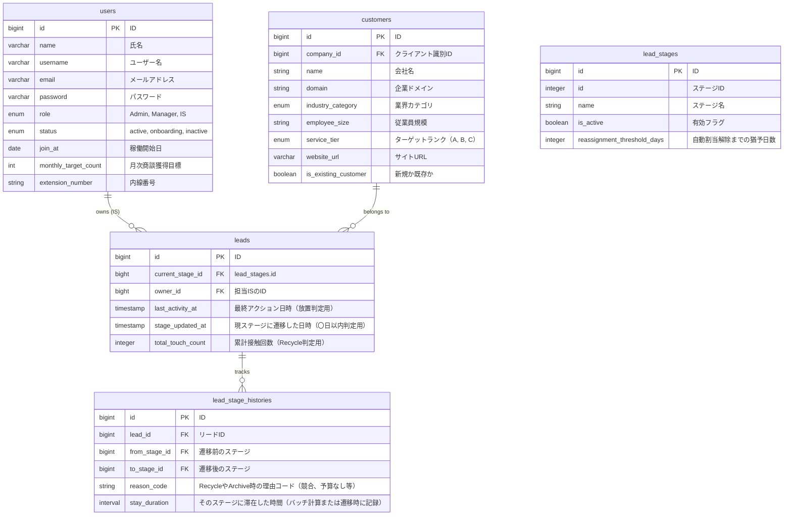

```mermaid　
erDiagram
    users ||--o{ leads : "owns (IS)"
    customers ||--o{ leads : "belongs to"
    leads ||--o{ lead_stage_histories : "tracks"
    users {
        bigint id PK "ID"
        varchar name "氏名"
        varchar username "ユーザー名"
        varchar email "メールアドレス"
        varchar password "パスワード"
        enum role "Admin, Manager, IS"
        enum status "active, onboarding, inactive"
        date join_at "稼働開始日"
        int monthly_target_count "月次商談獲得目標"
        string extension_number "内線番号"
    }

    customers {
    	bigint id PK "ID"
    	bigint company_id FK "クライアント識別ID"
    	string name  "会社名"
    	string domain  "企業ドメイン"
    	enum industry_category  "業界カテゴリ"
    	string employee_size  "従業員規模"
    	enum service_tier  "ターゲットランク（A, B, C）"
    	varchar website_url  "サイトURL"
    	boolean is_existing_customer  "新規か既存か"
    }

    leads {
    	bigint id PK "ID"
        bight current_stage_id FK "lead_stages.id"
        bight owner_id FK "担当ISのID"
        timestamp last_activity_at "最終アクション日時（放置判定用）"
        timestamp stage_updated_at "現ステージに遷移した日時（〇日以内判定用）"
        integer total_touch_count "累計接触回数（Recycle判定用）"
    }

    lead_stages {
        bigint id PK "ID"
        integer id "ステージID"
        string name "ステージ名"
        boolean is_active "有効フラグ"
        integer reassignment_threshold_days "自動割当解除までの猶予日数"
    }

    lead_stage_histories {
        bigint id PK "ID"
        bigint lead_id FK "リードID"
        bigint from_stage_id FK "遷移前のステージ"
        bigint to_stage_id FK "遷移後のステージ"
        string reason_code "RecycleやArchive時の理由コード（競合、予算なし等）"
        interval stay_duration "そのステージに滞在した時間（バッチ計算または遷移時に記録）"
    }
```
